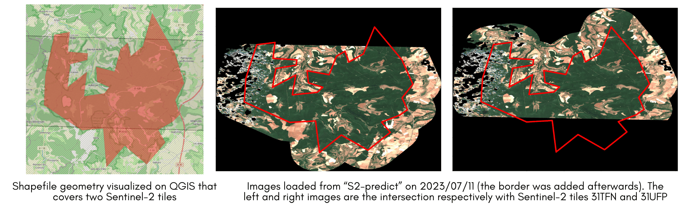

# Load Data

## Description

This module aims to load the data from the Sentinel-2 satellite imagery. The data is collected from the Harmonized Sentinel-2 dataset from Google Earth Engine API. The module provides 3 subcommands: `S2-train`,  `S2-predict` and `S2-fordead`.

## Methodology

### Data Source

The data for this project is collected from the [Harmonized Sentinel-2](https://developers.google.com/earth-engine/datasets/catalog/COPERNICUS_S2_SR_HARMONIZED) dataset from Google Earth Engine API.

### Geometries

The script requires a shapefile of geometries, either Points or Polygons. Points are recommended for the training dataset, while Polygons are recommended for the prediction dataset. You can apply a custom buffer to the geometries to increase the area of interest and improve the model's performance.

During training, only the best image with the least clouds is kept for each geometry. During prediction, all images that intersect with the geometry's tiles are kept to handle incomplete images. For more information about the tiling system, refer to the [Copernicus Sentinel-2 documentation](https://sentiwiki.copernicus.eu/web/s2-products).

### Extracting Images for Training versus Prediction/Fordead

#### Training

For the training dataset, we recommand using Points as geometries, amongst the centroids of the tiles of Sentinel-2 Grid System. You can also use Polygons as geometries. Nonetheless, to avoid having a tile that doesn't contain the entire geometry but only intersects with it, we recommend adding a `Name` field to the shapefile with the name of the tile Sentinel-2 Grid System. This way, the script will filter the images to keep only the ones that intersect with the geometry's tile.

The images will be then filtered to keep the one with the fewest clouds if possible and may result in no image for some geometries if the `MAX_THRESHOLD_CLOUD_COVER` is reached. A request is thus made for a threshold of cloud cover from 0 to `MAX_THRESHOLD_CLOUD_COVER` with a step of `STEP_CLOUD_COVER`.

#### Prediction

For the prediction dataset, we recommend using Polygons as geometries to describe the area of interest. A buffer of `BUFFER_PREDICTION` meters is applied to the geometries to increase the area of interest and improve the model's performance at the edges of the geometries. All the images that intersect with the geometry's tiles are kept to handle incomplete images (when a Geometry is on multiple tiles but not entirely on one tile). You can visualize an example below:

The resulting images are the intersecting tiles clipped to the geometry's extent. In addition, a 1D mask array to describe the location of the clouds in the image is computed. The mask is a binary array with 1 for pixels with clouds and 0 for pixels without clouds and is stored as a `.npy` file. It aims to rebuild the prediction image after the model's prediction to know where the prediction should have been made but couldn't because of clouds.

#### Fordead

For the fordead dataset, we recommend using Polygons as geometries to describe the area of interest. A buffer of `BUFFER_PREDICTION` meters is applied to the geometries to increase the area of interest and improve the model's performance at the edges of the geometries. All the images that intersect with the geometry's tiles are kept to handle incomplete images (when a Geometry is on multiple tiles but not entirely on one tile). The resulting images are the intersecting tiles clipped to the geometry's extent.

### Preprocessing before Downloading

Before downloading the images, they undergo preprocessing, which includes the following steps:

1. Applying a mask to keep only bare soil and vegetation. The mask is derived from the Scene Classification Layer (SCL) band computed by the ESA. Pixels with values other than 4 (bare soil) and 5 (vegetation) are set to 0 and become black.

2. Computing 13 vegetation indices based on the article "[Detecting Pest-Infested Forest Damage through Multispectral Satellite Imagery and Improved UNet++](https://doi.org/10.3390/s22197440)". The formulas for these indices are described in the file [`goodforest-cli/config/vegetation_indices.py`](../config/vegetation_indices.py).

3. Linearly stretching the values of the Sentinel-2 bands from the range $[0, 10^5]$ to $[0, 255]$. Empirical measurements have shown that the values of each band are generally located in smaller ranges, which are described in the file [`goodforest-cli/config/sentinel2_bands.py`](../config/sentinel2_bands.py).

4. Stretching the values of the vegetation indices to the range $[0, 255]$. The natural ranges of the vegetation indices, which are typically $[-1, 1]$, are scaled using a linear transformation to the range $[0, 255]$. For more complex indices, the range is empirically determined and described in the file [`goodforest-cli/config/vegetation_indices.py`](../config/vegetation_indices.py).

Note that for the fordead function, the steps 2, 3 and 4 do not apply (and we would recommand to add a mask for the clouds in the first step with a threshold to set at which cloud cover percentage the image is not taken into account)